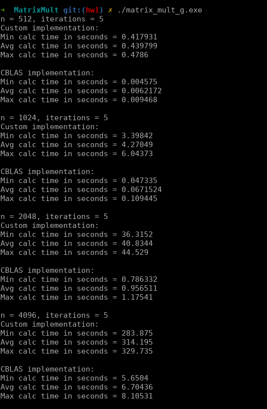
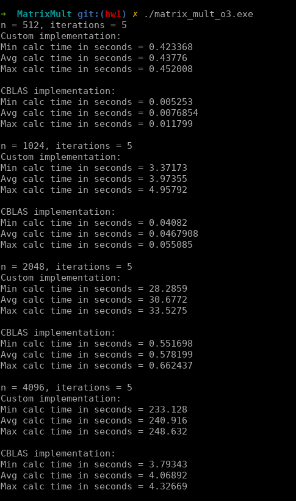
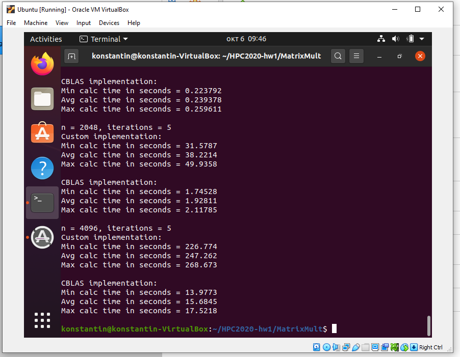
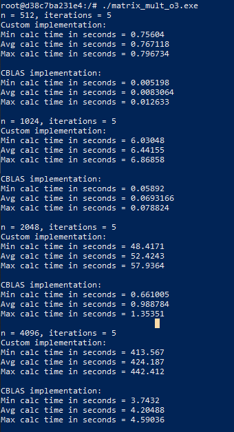
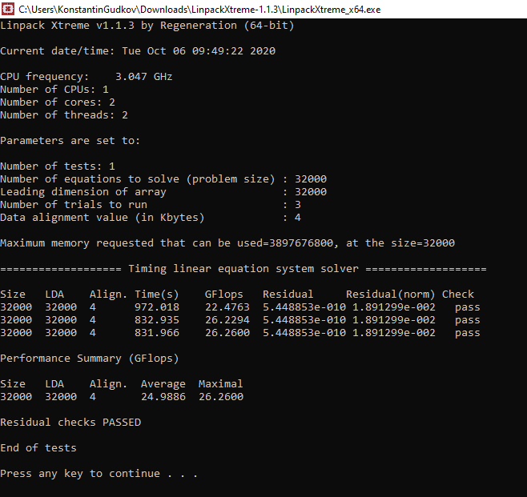

# HW1: Перемножение матриц 

Операции перемножения матриц реализованы в классе Matrix: в качестве входных параметров могут приходить две матрицы размеров `NxM` и `MxK`.  
Перегруженный оператор `*` реализует кастомное перемножение матриц, `^` -- перемножение с использованием библиотеки CBLAS.  
Вызов main запускает выполнение скрипта для рандомных квадратных матриц размера 512, 1024, 2048, 4096.
Метрики скорости выполнения для кастомной и CBLAS реализаций выводятся в stdout.

## Сборка файла выполнения
Сборка делается при помощи команды `make all`, которая триггерит сборку `matrix.o`, который впоследствии статически 
линкуется с `main.cpp`. Также сборка динамически линкует библиотеку `blas`.  

В качестве результата сборки создаются для исполняемых файла `matrix_mult_o3.exe` и `matrix_mult_g.exe` с соответствующими 
флагами оптимизации.

## Результаты
В результате выполнения были выявлены следующие тенденции:

1. Флаг `-O3` положительно влияет на производительность по сравнению с флагом `-g`.
2. CBLAS существенно быстрее кастомной имплементации (в 50-100 раз).
3. Использование порядка итерирования по (`m`, `n`, `k`), который эффективно использует кэш, 
   привело к существенному ускорению кастомного кода (~x2).
4. Выполнение кода в докере происходило чуть медленнее, чем выполнение внутри VM. Полагаю, это связано с тем, что для 
   запуска линуксовых контейнеров Docker for Windows запускает отдельную VM, 
   в результате чего приходится пробиваться через два слоя абстракции.

## Выполнение в разных окружениях 

### Выполнение в локальном окружении (Windows WSL):



### Выполнение внутри VM:


### Выполнение внутри Docker:  


### Реализация базовых скриптов bash

1. Organize FOR loop printing the even numbers only from 100 to 1000
```
for i in `seq 100 2 1000`; do echo $i; done
```
2. Initialize the array of 10-20 elements and organize FOR loop printing the elements of the array.
```
➜  ~ fd=(aaa "bbb ccc" ddd eee fff ggg 'hhh iii' jjj kkk lll)
➜  ~ for i in $fd; do echo $i; done                          
aaa
bbb ccc
ddd
eee
fff
ggg
hhh iii
jjj
kkk
lll
```
3. Compute 100 + 0.5 in bash
```
➜  ~ echo $((100 + 0.5))
100.5
```
4. Check if the "Linux" exists in the present directory.
```
if [ -f "Linux" ]; then echo "course"; else echo "very easy"; echo "course is easy" > Linux; fi
```

### Результаты вызова теста LINPACK на локальном компьютере
Для тестирования использовалась утилита LinpackXtreme v1.1.3.



